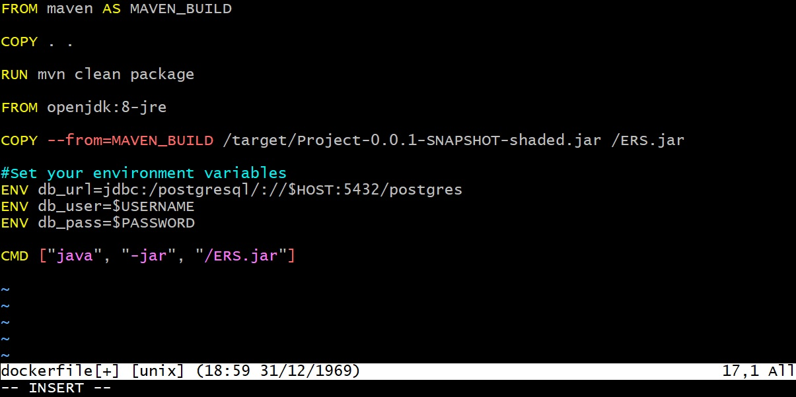

# Project-1
## Description
The Employee Reimbursement System (ERS) is a REST API that helps manage the process of reimbursing employees for expenses. 
Employees can be created and edited via the API. Expenses for employees can be added and updated to pending and approved. 
The application is a docker-compose project on a remote compute instance, hosted on the AWS Cloud Platform. 
Monitoring is also implemented, using Prometheus and Grafana.
## Technologies Used
* JDK 8
* Javalin 4.6.0
* Postgres 13.4-R1
* AWS EC2 AMI Kernel 5.10
* Prometheus
* Grafana
* Docker
* Postman
## Features
* Session-based authentication
* Prometheus metrics
* DB agnostic
## To-do
* HTTP logging
* Exception mapping
## Getting Started
First, you should create a work-space and clone this repo. You need to have Git installed. Install Git in Windows, or on your Linux machine, 
and you can begin cloning by clicking on `"Code"`, which is at the top of this page, clicking on `"HTTPS"`, and copying the URL. 
Open a terminal and navigate to your working directory. At the command line, type `git init .` and press `ENTER`. Next, type 
`git clone <paste aforementioned URL here>` and press `ENTER`. Once the the repo has been cloned, you can begin your configuration. I will leave it to
you to decide if you want to run the server locally, or on a remote instance with the provider of your choice. The schema for the database is in the `config` folder, 
within a file labeled `"schema"`. Since this project is intended to be run 
in a Docker container, I have included a screenshot of a sample Dockerfile which includes a section for adding environment variables.
 
## Usage
With the ERS up and running, you should be able to verify the endponts found in RequestMapping. You should now be able to send and
receive objects as `raw JSON`, such as in the screenshot below. Once you set Prometheus as your data source, in Grafana, you can monitor login attempts by creating a
panel and querying `total_login_attempts`.
 
### License
This project uses the following license: GNU GPL

